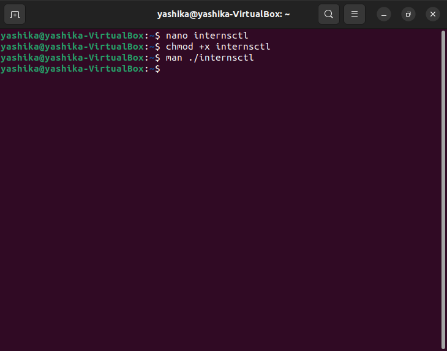
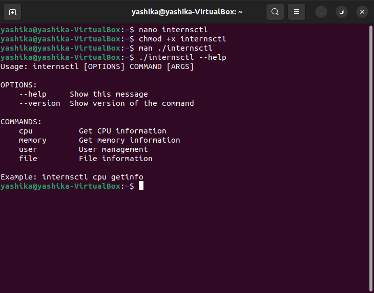
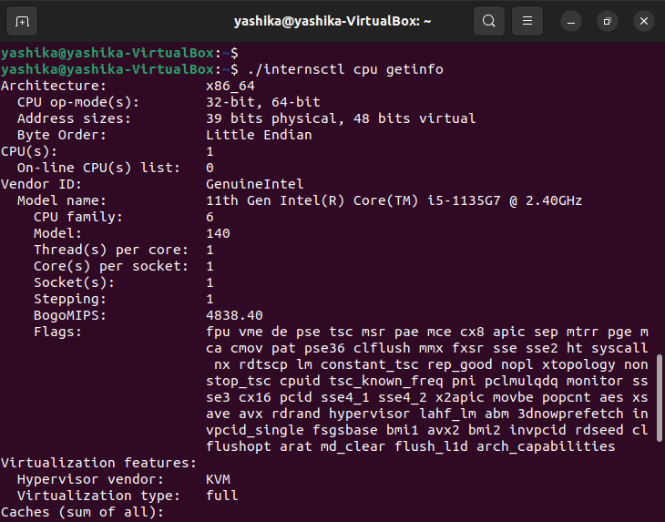
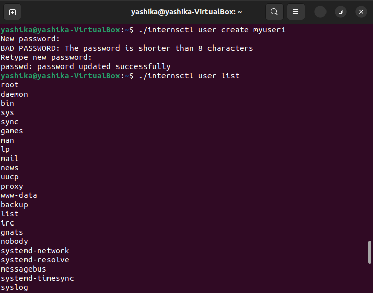
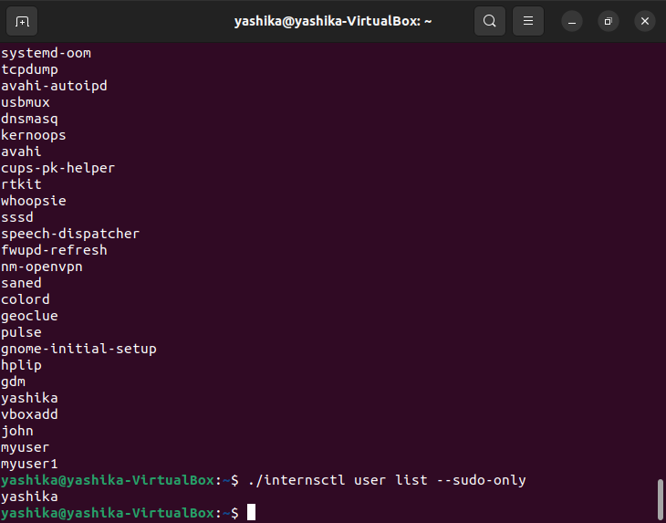

# Xenonstack-task-Linux
# internsctl - Custom Linux Command

## Description

`internsctl` is a custom Linux command designed for intern operations. This command provides various functionalities to manage CPU information, memory information, user operations, and file details. The current version is v0.1.0.

## Section A

### 1. Manual Page

To view the manual page, execute the following command:

```bash
man internsctl
```

<br>


This will display the full documentation and usage guidelines for the command.

### 2. --help Option

To get usage examples and help information, use the following command:

```bash
internsctl --help
```


This will provide you with necessary usage guidelines and examples.

### 3. --version Option

To see the version of the command, execute:

```bash
internsctl --version
```


## Section B

### Part1 | Level Easy

#### a. Get CPU Information

To obtain CPU information, use the following command:

```bash
internsctl cpu getinfo
```


The output will be similar to the information obtained from the `lscpu` command.

#### b. Get Memory Information

To retrieve memory information, run the following command:

```bash
internsctl memory getinfo
```


---

## Part 2 - Intermediate Level

### Create a New User

To create a new user who can log in to the Linux system and access their home directory, use the following command:

```bash
$ internsctl user create
```

### List Regular Users

To list all regular users present on the server, use the following command:

```bash
$ internsctl user list
```

### List Users with Sudo Permissions

To list all users with sudo permissions on the server, use the following command:

```bash
$ internsctl user list --sudo-only
```




## Part 3 - Advanced Level

### Get File Information

To get information about a file, use the following command:

```bash
$ internsctl file getinfo <filename>
```

#### Expected Output Format:

```bash
xenonstack@xsd-034:~$ internsctl file getinfo hello.txt
File: hellot.txt
Access: -rw-r--r—
Size(B): 5448
Owner: xenonstack
Modify: 2020-10-07 20:34:44.616123431 +0530
```

#### Options:

- **--size, -s:** Print file size
- **--permissions, -p:** Print file permissions
- **--owner, -o:** Print file owner
- **--last-modified, -m:** Print last modified time


#### Example with Options:

```bash
$ internsctl file getinfo hello.txt --size --permissions
```

---
<p align="center">
  Made with ❤️ by <a href="https://github.com/Yashika-Developer">Yashika</a>
</p>


